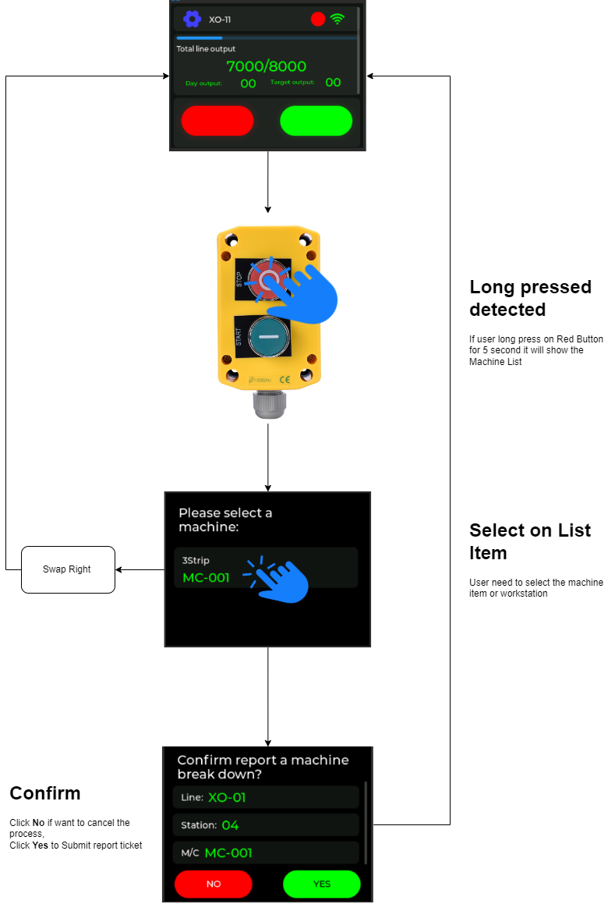

# M5STACK LTIE-ENCOUNTER AND LTM INTEGRATE

M5Stack LTM, TLS and LTM integration 3 in 1 device, it working as Output Signal and Triger input when button pressed or long pressed. 

# HOW IT WORK?

When user long press the button M5Stack will popup new screen of LTM Machine select

## LTMechanic create Report ticket

